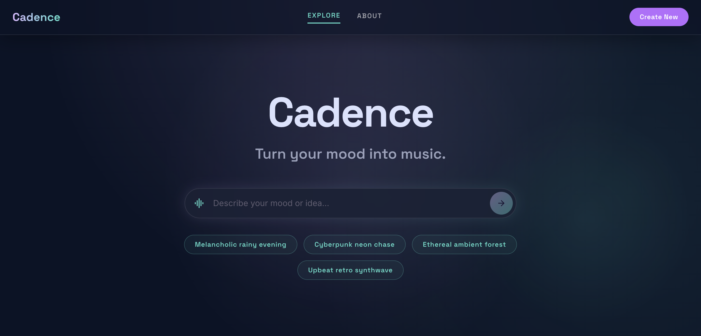
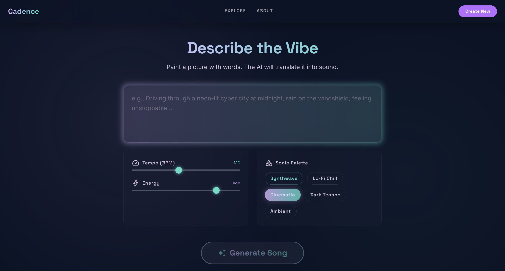
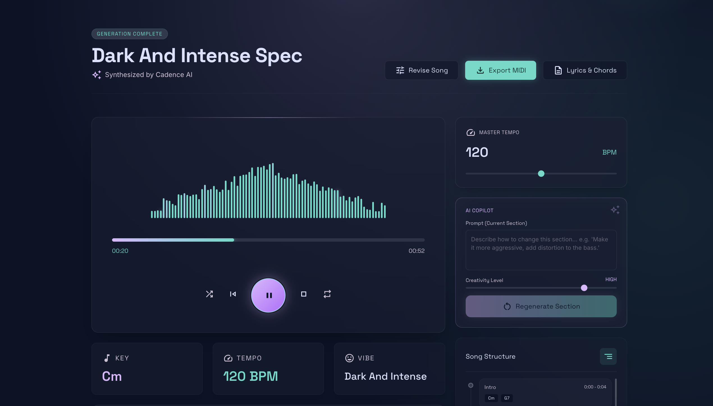

# Cadence — Turn your mood into music.

> Describe how you feel. Get a complete song, instantly.

Cadence is an AI-powered music generation app that transforms a plain-language mood or scene description into a structured, playable song — complete with chords, tempo, sections, and in-browser audio playback — with no music theory knowledge required from the user.

---

## Problem Statement

Most people have musical ideas — a feeling they want to capture, a scene they're imagining, a memory they want to score. But turning that intent into actual music requires skills that take years to develop: music theory, DAW software proficiency, instrument technique, and arrangement knowledge.

This gap between **creative intent** and **musical output** means most ideas never become music. Cadence closes that gap by letting anyone produce a structured, playable song from a single sentence.

---

## Solution

Cadence lets a user type a mood or idea in plain English (e.g. *"melancholic late-night jazz with a slow tempo"* or *"upbeat summer pop road trip song"*). The app then:

1. Sends the prompt to **IBM watsonx.ai**, which generates a complete structured song specification (key, tempo, chord progression, sections, instrumentation, lyrics)
2. Plays the song back **immediately in-browser** using **Tone.js** and the Web Audio API — no server round-trips for audio
3. Lets the user **iterate and refine** using plain-English instructions (e.g. *"make it more upbeat"*, *"swap piano for guitar"*)
4. Exports the result as a **.mid (MIDI) file** or a **plain-text spec** for use in any DAW or music production tool

---

## AI Approach & Architecture

### Flow

```
User Input (natural language)
       │
       ▼
IBM watsonx.ai  ──────────────────────────────────────────────────────────────────
│  Model: meta-llama/llama-3-3-70b-instruct (via watsonx.ai API)                  │
│  Role: Interpret mood/genre/scene → generate structured JSON song spec           │
│  Output: { key, tempoBPM, mood, chordProgression, sections, lyrics }             │
└──────────────────────────────────────────────────────────────────────────────────
       │
       ▼
Song Spec (JSON)
       │
       ├──► Tone.js (Web Audio API)
       │         Real-time in-browser audio synthesis and playback
       │         Instruments rendered via synth voices mapped to chord/note data
       │
       └──► Export Layer
                ├── midi-writer-js  →  .mid file download
                └── Plain-text spec →  .txt file download
```

### Key Technical Decisions

| Decision | Rationale |
|---|---|
| Symbolic music generation (JSON spec) instead of raw audio | Gives full, granular control over every instrument, tempo, chord, and section after generation |
| Client-side synthesis via Tone.js | Zero-latency iteration — users hear changes instantly without server round-trips |
| Structured JSON schema with Zod validation | Ensures the AI output is always machine-readable and playable; auto-repair logic handles minor schema deviations |
| watsonx.ai API called server-side only | API keys never reach the browser; all credentials stay in server environment |

---

## Selected Challenge Theme / Track

> **July Challenge: Reimagine Creative Industries with AI**

---

## How IBM Bob Was Used

IBM Bob was the primary development tool used throughout the entire build process of Cadence. Specifically, it was used to:

- **Scaffold and implement all major UI screens** from Stitch design references — including the Home page, Describe Your Mood (create) page, Generating Music loading screen, Your Generated Song player view, Iterate & Refine studio controls, Export modal, and About page
- **Wire up the watsonx.ai API integration** — implementing the IAM token exchange, structured prompt engineering, Zod schema validation, and the auto-repair logic for model output
- **Debug the watsonx.ai 502 errors** caused by IBM's withdrawal of the `granite-3-8b-instruct` model, identifying the correct replacement model and fixing the schema validation pipeline
- **Build and fix the Tone.js audio engine** — real-time chord synthesis, transport control, waveform visualization, and playback scrubbing
- **Implement MIDI and text export** using midi-writer-js, wired to the generated song spec
- **Fix the TopNav and Footer** — replacing dead links with functional Next.js `<Link>` routing and removing non-functional placeholder UI elements
- **Manage the full development loop**: lint fixes, TypeScript type errors, production build validation

IBM Bob enabled a single developer to design, implement, and ship a full-stack AI music application across multiple interconnected UI screens within the challenge timeframe.

---

## Tech Stack

| Layer | Technology |
|---|---|
| Frontend framework | Next.js 14 (App Router) |
| Styling | Tailwind CSS |
| Core AI | IBM watsonx.ai (`meta-llama/llama-3-3-70b-instruct`) |
| Audio synthesis | Tone.js (Web Audio API) |
| MIDI export | midi-writer-js |
| Schema validation | Zod |
| UI design reference | Google Stitch |
| Primary dev tool | IBM Bob |
| Language | TypeScript |

---

## Features

- 🎵 **Mood-to-song generation** — type any mood, scene, or genre description; get a complete song spec back
- 🔊 **Instant in-browser playback** — audio rendered client-side via Tone.js, no audio server required
- 🔁 **Iterative refinement** — send follow-up instructions to mutate the song (tempo, mood, instruments, sections)
- 📁 **MIDI export** — download a `.mid` file playable in any DAW (GarageBand, Ableton, Logic Pro, etc.)
- 📄 **Text spec export** — download the full song spec as a readable `.txt` file
- 📱 **Responsive design** — works on desktop and mobile
- 🌐 **About / How It Works** page — explains the architecture for judges and end users

---

## Getting Started — Local Setup

### Prerequisites

- Node.js 18+
- An IBM Cloud account with a watsonx.ai project

### 1. Clone the repo

```bash
git clone https://github.com/CodeCatalyst-07/Cadence.git
cd Cadence
```

### 2. Install dependencies

```bash
npm install
```

### 3. Set up environment variables

Copy the example file and fill in your credentials:

```bash
cp .env.local.example .env.local
```

Open `.env.local` and set the following — **do not commit this file**:

```env
WATSONX_API_KEY=        # IBM Cloud IAM API key
WATSONX_PROJECT_ID=     # watsonx.ai project ID (from Manage tab)
WATSONX_URL=            # Regional endpoint, e.g. https://us-south.ml.cloud.ibm.com
```

> Your `.env.local` is gitignored and will never be committed.

### 4. Run the development server

```bash
npm run dev
```

Open [http://localhost:3000](http://localhost:3000) in your browser.

---

## Screenshots

> _Screenshots will be added to the `/public/screenshots/` directory._

### Home Page


### Describe Your Mood


### Your Generated Song


---

## Project Structure

```
cadence/
├── app/
│   ├── about/          # How Cadence Works page
│   ├── api/
│   │   └── generate-song/   # POST endpoint — watsonx.ai integration
│   ├── components/
│   │   ├── TopNav.tsx
│   │   └── Footer.tsx
│   ├── create/         # Describe Your Mood page
│   ├── page.tsx        # Home + Song player + Studio view (SPA-style)
│   └── globals.css
├── lib/
│   ├── watsonx.ts      # watsonx.ai API client + IAM token cache
│   ├── songSchema.ts   # Zod schema + validateAndRepair
│   ├── audioEngine.ts  # Tone.js synthesis engine
│   └── chordMapping.ts
├── types/
│   └── song.ts
├── .env.local.example  # Template — safe to commit (no real values)
└── tailwind.config.ts
```

---

## Security Note

- All watsonx.ai API calls are made **server-side only** (`/app/api/generate-song/route.ts`)
- The `WATSONX_API_KEY` is never exposed to the browser or bundled into client JS
- `.env.local` is covered by `.gitignore` and will not be committed

---

*Built for the AI Builders Challenge · IBM watsonx.ai + IBM Bob*
